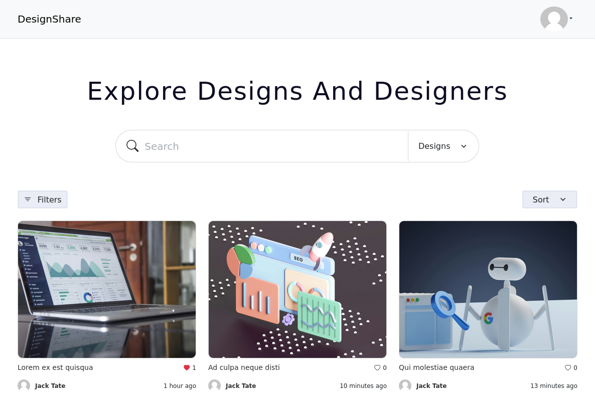

<p align="center"><a href="designshare.uk.to" target="_blank"><h1>DesignShare</h1></a></p>



# DesignShare - Api

DesignShare is a platform where designers can share their designs. This repository contains the Laravel api for the DesignShare application.

## Requirements

- <a href="https://php.net" target="_blank">PHP</a> (version 8.1 or higher)
- <a href="https://getcomposer.org" target="_blank">Composer</a>
- <a href="https://nodejs.org" target="_blank">Node.js</a>
- <a href="https://git-scm.com" target="_blank">Git</a>
- <a href="https://www.mysql.com" target="_blank">Mysql</a>
- And <a href="https://laravel.com/docs/10.x/deployment##server-requirements" target="_blank">All requirements by Laravel 10</a>

## Quick Start

### Installation

* Clone the repository
* Install dependencies:
```bash
composer install
php artisan key:generate
php artisan migrate
php artisan serve
```
### Configuration

* Set the database information in .env
* Set the QUEUE_CONNECTION to database in .env
* Set the SANCTUM_STATEFUL_DOMAINS to your frontend domains in .env
* Set the default upload disk in the config/site.php file